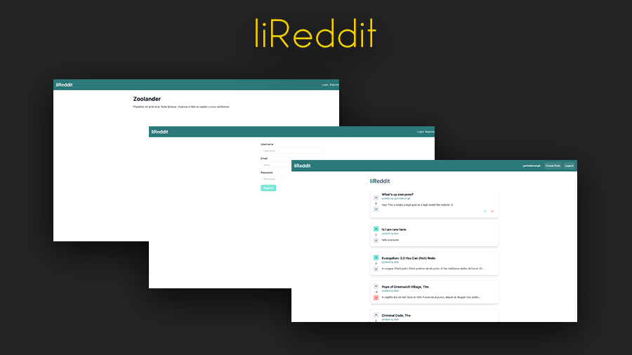

# liReddit

#### A mini Reddit clone. Built with TypeGraphQL, Node, Express, URQL, Redis, and React.



## Steps to run the Server
```
cd lireddit-server
yarn watch
yarn dev
```

## Steps to run the Front End
```
cd lireddit-web
yarn dev
```

Check out the package.json file in ```lireddit-server/``` and ```lireddit-web/``` for other scripts.